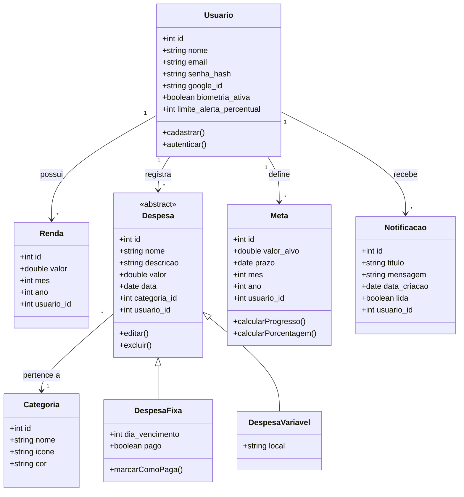

# Diagrama de Classes — PoupaPobre

Este documento descreve a estrutura lógica dos dados do sistema, que servirá de base para a implementação do banco de dados SQLite.

## 1. Diagrama de Classes (Mermaid)

---

## 2. Descrição das Entidades

### 2.1. Usuário
Representa a pessoa autenticada no sistema. Centraliza todas as informações financeiras. O `google_id` é preenchido apenas se o usuário optar pelo login via Google. O `limite_alerta_percentual` define em qual porcentagem do orçamento gasto o sistema deve disparar notificações.

### 2.2. Renda
Armazena os ganhos mensais. É vinculada a um mês e ano específicos para permitir o cálculo de saldo histórico.

### 2.3. Despesa (Base)
Uma classe abstrata que contém os campos comuns a qualquer gasto, incluindo uma `descricao` opcional. 
- **Despesa Fixa:** Inclui o status de pagamento e o dia do mês em que vence.
- **Despesa Variável:** Gastos do dia a dia (ex: mercado, lazer).

### 2.4. Categoria
Tabela auxiliar para organizar os gastos (Ex: Moradia, Alimentação, Transporte). Cada categoria pode ter uma cor e ícone para facilitar a visualização nos gráficos.

### 2.5. Meta de Economia
Permite ao usuário estipular um valor que deseja poupar em um determinado período (`mes` e `ano`). O sistema utiliza a soma das rendas e despesas para calcular automaticamente o quanto falta e a porcentagem do saldo comprometida para esta meta.

### 2.6. Notificação
Registra no banco de dados os alertas disparados pelo sistema (ex: "Você atingiu 80% dos gastos"). Isso permite criar uma central de avisos e histórico dentro do aplicativo.
