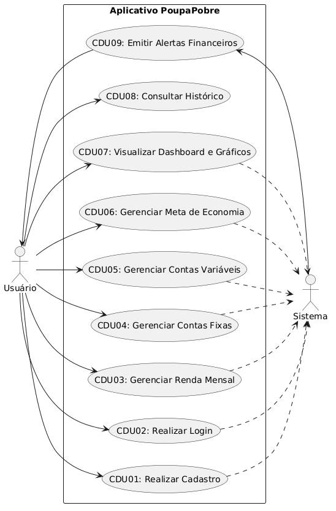
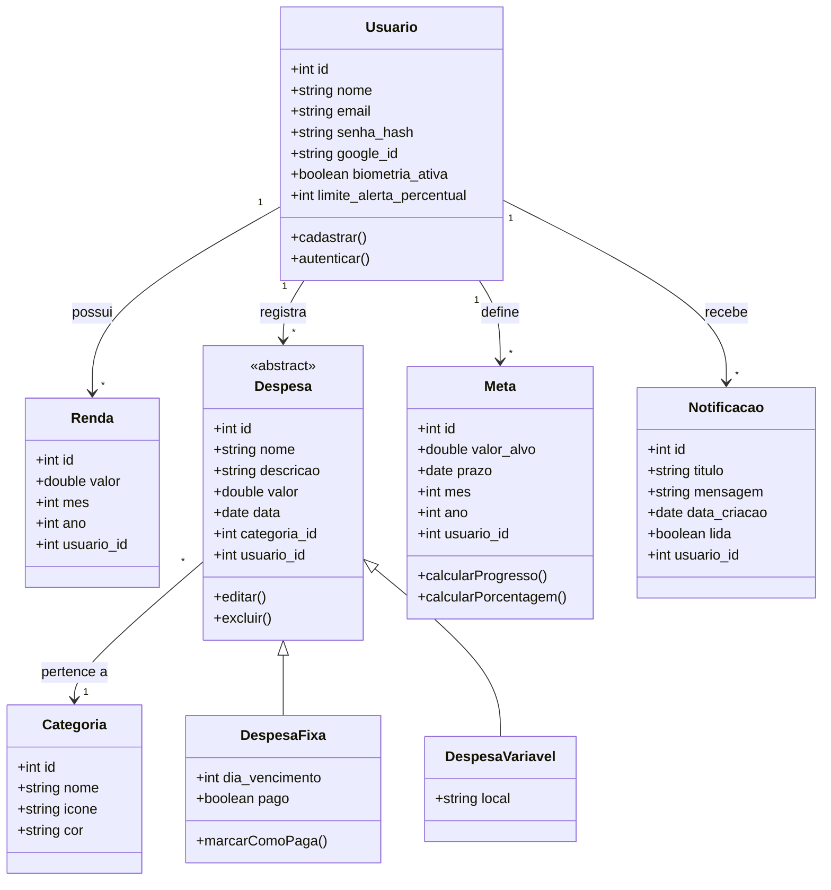
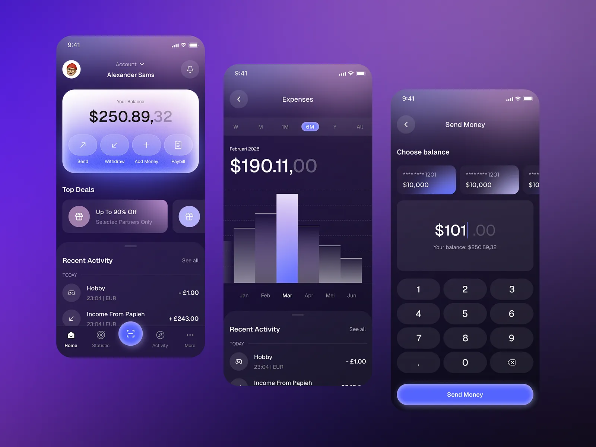
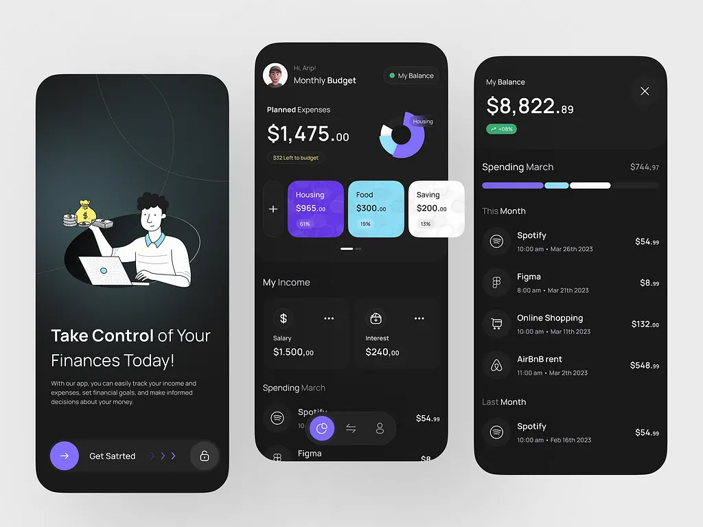

# Documentação Técnica — Projeto PoupaPobre

Este documento reúne toda a documentação de requisitos, casos de uso e arquitetura lógica do aplicativo PoupaPobre.

---

# 1. Requisitos do Sistema

## Informações Gerais

| Campo             | Detalhe                        |
|-------------------|-------------------------------|
| **Nome do Sistema** | PoupaPobre             |
| **Plataforma**    | Mobile — React Native (Expo)  |
| **Tipo de Uso**   | Pessoal (usuário único)       |
| **Versão**        | 1.0                           |
| **Data**          | Abril de 2026                 |

---

## 1.1. Introdução

O **PoupaPobre** é um aplicativo mobile de gestão financeira pessoal.
O sistema permite ao usuário registrar sua renda, controlar despesas fixas e variáveis, definir metas de economia e acompanhar sua gestão financeira por meio de relatórios e gráficos, auxiliando na tomada de decisões e no desenvolvimento do hábito de economizar.

---

## 1.2. Escopo

O sistema contempla as seguintes macrofuncionalidades:

- Autenticação de usuário (cadastro, login por e-mail, Gmail e biometria)
- Registro e gestão de renda mensal
- Registro e gestão de contas fixas e variáveis
- Definição e acompanhamento de metas de economia baseado no salário e contas fixas cadastrados  
- Relatórios e gráficos financeiros
- Histórico de meses anteriores
- Notificações e alertas financeiros

---

## 1.3. Requisitos Funcionais

| ID    | Descrição                                                                 | Prioridade |
|-------|---------------------------------------------------------------------------|------------|
| RF01  | O usuário deve poder se **cadastrar** com nome, e-mail e senha            | Alta       |
| RF02  | O usuário deve poder realizar **login com e-mail e senha**                | Alta       |
| RF03  | O usuário deve poder realizar **login com conta Google** (Gmail/OAuth)    | Alta       |
| RF04  | O usuário deve poder realizar **login com biometria** (digital)           | Alta       |
| RF05  | O usuário deve poder **cadastrar sua renda mensal** (salário)             | Alta       |
| RF06  | O usuário deve poder **cadastrar contas fixas** com nome, valor, data de vencimento e descrição opcional (ex: aluguel, plano de saúde) | Alta       |
| RF07  | O usuário deve poder **cadastrar contas variáveis** com nome, valor e data (ex: mercado, lazer, transporte)                            | Alta       |
| RF08  | O sistema deve **calculate automaticamente** o saldo disponível após deduzir todas as despesas da renda cadastrada                       |     Alta       |
| RF09  | O usuário deve poder **definir uma meta de economia** mensal com valor-alvo e prazo                                                   | Alta       |
| RF10  | O sistema deve **exibir o progresso** da meta de economia                | Alta       |
| RF11  | O sistema deve **alertar o usuário** quando os gastos se aproximarem do limite do orçamento definido                              | Média      |
| RF12  | O usuário deve poder **categorizar** suas despesas (ex: alimentação, moradia, saúde, lazer)                                | Média      |
| RF13  | O sistema deve exibir **relatórios e gráficos** de gastos por categoria  | Média      |
| RF14  | O sistema deve manter **histórico financeiro de meses anteriores**       | Média      |
| RF15  | O usuário deve poder **editar e excluir** qualquer lançamento registrado | Alta       |
| RF16  | O usuário deve poder **marcar contas fixas como pagas**                  | Alta       |

---

## 1.4. Requisitos Não Funcionais

| ID     | Descrição                                                                 | Categoria      |
|--------|---------------------------------------------------------------------------|----------------|
| RNF01  | O app deve ser compatível com **Android**                           | Portabilidade  |
| RNF02  | O login biométrico deve utilizar a **API nativa do dispositivo**          | Segurança      |
| RNF03  | As senhas devem ser **armazenadas com criptografia (hash)**               | Segurança      |
| RNF04  | Os dados financeiros devem ser **armazenados localmente (SQLite)** | Segurança      |
| RNF05  | O app deve ter **tempo de resposta inferior de 4 segundos nas operações principais** | Performance    |
| RNF06  | A interface deve ser **responsiva e acessível**, permitindo o cadastro de gastos em até 3 cliques da home | Usabilidade    |
| RNF07  | O app deve permitir **consulta offline** dos dados já carregados          | Disponibilidade|
| RNF08  | O sistema deve ser desenvolvido com **React Native, Expo e SQLite**       | Tecnologia     |

---

## 1.5. Regras de Negócio

| ID    | Regra                                                                               |
|-------|-------------------------------------------------------------------------------------|
| RN01  | O saldo disponível é calculado como: `Renda - (Σ Contas Fixas + Σ Contas Variáveis)` |
| RN02  | Uma conta fixa não paga no mês vigente deve permanecer como **pendente**            |
| RN03  | A meta de economia não pode ser maior que a renda mensal cadastrada                 |
| RN04  | O histórico deve ser agrupado e consultado **por mês e ano**                        |
| RN05  | O login biométrico só pode ser ativado após o primeiro login com Gmail    |
| RN06 | Ao criar uma meta de economia é calculado com o valor do saldo quantos porcentos pode ser economizado | |

---

## 1.6. Restrições

- O sistema, em sua versão inicial, é destinado a **uso individual** (um único usuário por instalação)
- Não há suporte a múltiplas moedas nesta versão
- O app não realiza integração com bancos ou APIs financeiras externas nesta versão

---

# 2. Casos de Uso

## 2.1. Atores

*   **Usuário:** Pessoa física que utiliza o aplicativo para organizar e controlar suas finanças pessoais.
*   **Sistema:** O próprio aplicativo PoupaPobre.

---

## 2.2. Diagrama de Casos de Uso

| ID | Nome do Caso de Uso | Ator Principal | Ator Secundário | Descrição Resumida |
| :--- | :--- | :--- | :--- | :--- |
| **CDU01** | Realizar Cadastro | Usuário | Sistema | Criar conta no aplicativo informando dados básicos. |
| **CDU02** | Realizar Login | Usuário | Sistema | Autenticação para acesso. |
| **CDU03** | Gerenciar Renda Mensal | Usuário | Sistema | Registrar valor da renda. |
| **CDU04** | Gerenciar Contas Fixas | Usuário | Sistema | Controlar despesas recorrentes. |
| **CDU05** | Gerenciar Contas Variáveis | Usuário | Sistema | Controlar despesas esporádicas. |
| **CDU06** | Gerenciar Meta de Economia | Usuário | Sistema | Definir valor-alvo mensal. |
| **CDU07** | Visualizar Dashboard | Usuário | Sistema | Consultar interface de resumos. |
| **CDU08** | Consultar Histórico | Usuário | - | Acessar registros anteriores. |
| **CDU09** | Emitir Alertas | Sistema | Usuário | Disparar notificações. |

---

## 2.3. Especificação Detalhada

### CDU01: Realizar Cadastro
Permite que um novo usuário crie uma conta. Valida e-mail e senhas.

### CDU02: Realizar Login
Permite acesso via e-mail/senha, Google ou Biometria.

### CDU03: Gerenciar Renda Mensal
Define o valor total recebido no mês para basear os cálculos de saldo.

### CDU04: Gerenciar Contas Fixas
Cadastrar, editar e marcar como pagas as despesas recorrentes (ex: aluguel).

### CDU05: Gerenciar Contas Variáveis
Registro de gastos ocasionais (ex: restaurante, farmácia).

### CDU06: Gerenciar Meta de Economia
Permite planejar o quanto quer poupar no mês, com cálculo de porcentagem automática.

---

# 3. Diagrama de Classes e Arquitetura de Dados

Este diagrama descreve a estrutura lógica dos dados que servirá de base para o banco SQLite.

## 3.1. Estrutura de Classes

*Nota: O diagrama abaixo utiliza notação Mermaid.*

---

## 3.2. Descrição das Entidades

*   **Usuário:** Centraliza informações financeiras e configurações de alertas.
*   **Renda:** Ganhos vinculados a mês/ano.
*   **Despesa:** Classe base para gastos Fixos e Variáveis.
*   **Categoria:** Organização (Moradia, Alimentação, etc).
*   **Meta de Economia:** Valor planejado para poupar no período.
*   **Notificação:** Alertas de limite de gastos atingido.

---

# 4. Interface e Design Visual

Esta seção descreve a identidade visual e o protótipo de interface planejado para o PoupaPobre.

## 4.1. Design System: "The Luminous Vault"

O aplicativo segue uma estética moderna e "Premium", focada em reduzir a carga cognitiva de lidar com finanças através de um ambiente visualmente agradável.

*   **Paleta de Cores:** Foco em tons de violeta profundo e índigo (`#13121c`, `#5865f2`). Uso de verde esmeralda para indicadores de economia positiva e vermelho suave para alertas.
*   **Estética Glassmorphism:** Utilização de cartões com transparência e desfoque de fundo (*background-blur*), criando uma sensação de camadas e modernidade.
*   **Tipografia:** Uso de fontes geométricas (como *Inter* ou *Plus Jakarta Sans*) com pesos variados para destacar saldos e valores monetários.

## 4.2. Principais Telas do Protótipo

1.  **Dashboard (Home):** Apresenta o saldo total em um card de destaque com efeito de vidro. Contém botões de acesso rápido para os principais fluxos (Nova Despesa, Receita, Metas).
2.  **Minhas Metas:** Exibe um gráfico circular de progresso do orçamento mensal e uma lista de metas individuais com barras de progresso dinâmicas.
3.  **Lançamento de Gastos:** Interface otimizada para inserção rápida de valores, com teclado numérico em destaque e seleção de categorias por ícones.
4.  **Autenticação:** Telas de Login e Cadastro minimalistas, com suporte visual para entrada via Biometria (FaceID/Digital).

## 4.3. Referências Visuais
O design é inspirado em interfaces de alta fidelidade que priorizam o uso de gradientes suaves e a ausência de bordas rígidas, utilizando transições tonais para separar seções.

